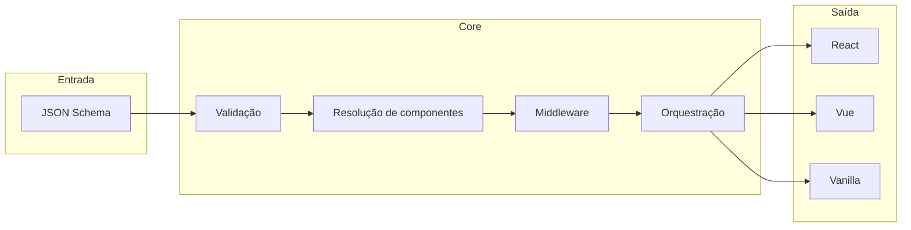

# Como o Schepta funciona por dentro

Este artigo é para quem quer ir mais fundo: como o Schepta pensa a UI — factories, orquestradores, component registry e o pipeline que leva do schema JSON até os elementos em React, Vue ou Vanilla. Inclui um diagrama do fluxo e referências ao código e à documentação de conceitos.

---

## Visão geral do fluxo

Um schema JSON entra na factory (por exemplo `FormFactory`); passa por validação, resolução de componentes, middlewares e orquestração; sai como árvore de elementos do framework. O mesmo core serve React, Vue e Vanilla através de adapters.



---

## Factories

O ponto de entrada é uma **factory** (por exemplo `FormFactory`). Ela recebe o schema e coordena todo o fluxo: validação do schema, resolução de componentes a partir do registry, aplicação dos middlewares e orquestração do render. Cada factory é especializada em um tipo de interface — formulários hoje; a arquitetura permite outras, como menus, no futuro.

Exemplo mínimo em React:

```tsx
import { FormFactory } from '@schepta/factory-react';
import type { FormSchema } from '@schepta/core';

const schema: FormSchema = {
  type: 'object',
  properties: {
    email: {
      type: 'string',
      'x-component': 'InputText',
      'x-component-props': { placeholder: 'Email' }
    }
  }
};

function MyForm() {
  return (
    <FormFactory
      schema={schema}
      onSubmit={(values) => console.log(values)}
    />
  );
}
```

O schema define a estrutura; a factory transforma isso em UI funcional.

---

## Orquestrador (Component Orchestrator)

O **Component Orchestrator** é a função que percorre o schema, decide qual componente usar, aplica visibilidade e ordenação, monta o caminho dos nomes dos campos e aplica a pilha de middlewares antes de delegar a criação do elemento ao runtime (React, Vue ou Vanilla). Ou seja: traduz cada nó do schema em uma decisão de render.

No código: `packages/core/src/orchestrators/component-orchestrator.ts`. Ele usa `resolveSpec` para obter o `ComponentSpec` a partir do `x-component` (ou da chave do nó), aplica `x-ui.visible`, constrói o `namePath` para campos aninhados e chama `applyMiddlewares` antes de passar o resultado ao renderer.

---

## Renderer Orchestrator

O **Renderer Orchestrator** decide como um componente é de fato envolvido na hora do render. Para campos (`field`), por exemplo, eles podem ser envolvidos por um “field renderer” que faz o binding com o form adapter (value, onChange). Para outros tipos — container, content, button — o fluxo é outro. A implementação está em `packages/core/src/orchestrators/renderer-orchestrator.ts`.

---

## Component Registry

No schema, `x-component` é um nome (por exemplo `"InputText"`). O **registry** é quem mapeia esse nome para um `ComponentSpec` (componente real, tipo, defaultProps). A ordem de resolução é: defaults da factory → Provider (global) → props da factory (local). Assim você pode trocar componentes por aplicação ou por instância sem mudar o schema.

Código: `packages/core/src/registries/component-registry.ts`.

---

## Pipeline: resolução → middleware → render

O percurso completo é:

1. **Schema JSON** → validação (estrutura, tipos).
2. **Lookup no registry** por `x-component` (e opcionalmente `x-custom`).
3. **Montagem de props** (incluindo `name`, `x-component-props`, `x-ui`).
4. **Resolução de expressões** (ex.: `{{ $formValues.x }}`, `{{ $externalContext.x }}`).
5. **Aplicação dos middlewares** (array em ordem).
6. **Criação do elemento** via runtime (`createElement` / `h`).

Isso está descrito em detalhe nos concept docs: [01. Factories](https://schepta.org/en-US/concepts/01-factories) e [04. Schema Resolution](https://schepta.org/en-US/concepts/04-schema-resolution).

---

## Referências no repositório

- **Component Orchestrator:** `packages/core/src/orchestrators/component-orchestrator.ts`
- **Renderer Orchestrator:** `packages/core/src/orchestrators/renderer-orchestrator.ts`
- **Component Registry:** `packages/core/src/registries/component-registry.ts`

A documentação completa, exemplos e showcases estão em [schepta.org](https://schepta.org). O repositório está no GitHub; contribuições e feedback são bem-vindos. Experimente o Schepta no seu próximo formulário ou fluxo server-driven e, se fizer sentido, contribua com melhorias ou novos casos de uso.

Este é o último artigo da série. Para rever a ordem completa, veja o [índice da série](README.md).
